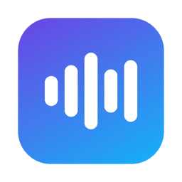
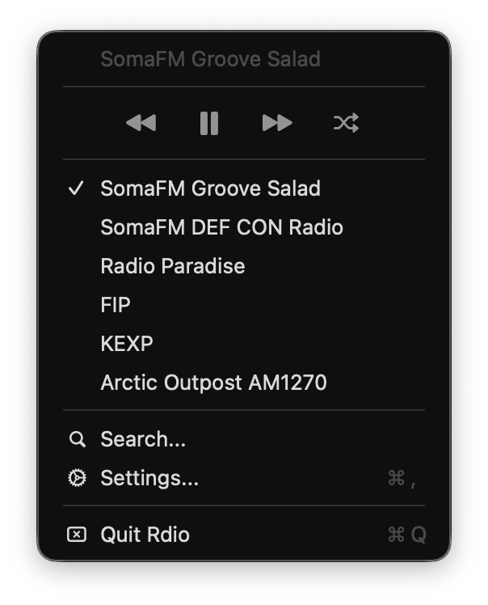
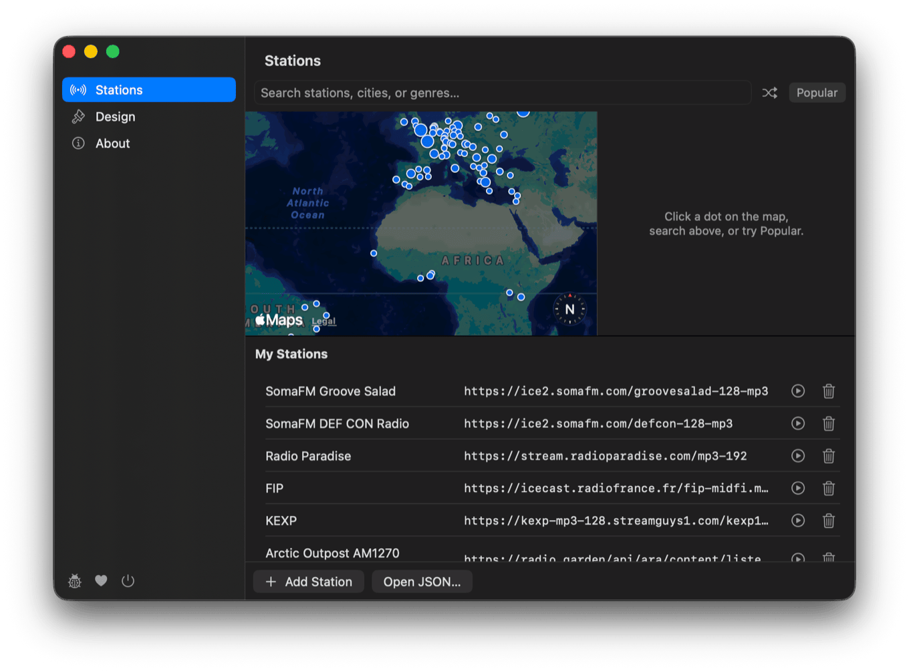
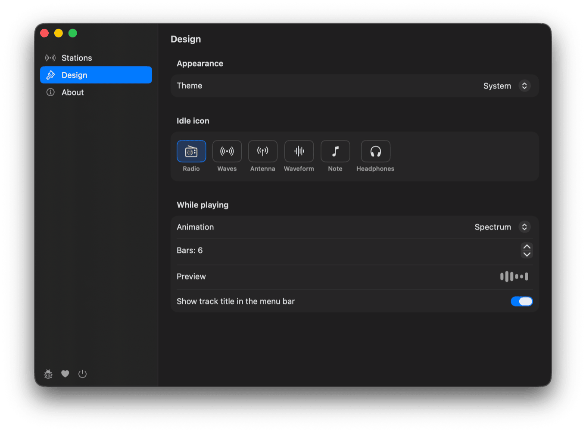

<p align="center">
  
</p>

<h1 align="center">Rdio</h1>

<p align="center">
  A tiny, native macOS menu bar radio player.
</p>

---

## Install

```sh
make app
open Rdio.app
```

Move `Rdio.app` to `/Applications` to keep it around. You'll need Xcode or the Command Line Tools.

> Prefer `make app` over `make run`. The bundled `Info.plist` carries the App
> Transport Security exception that `http://` streams need; the bare binary
> `make run` builds doesn't have it.

## The menu

Everything lives behind the menu bar icon: play/pause, skip, shuffle, and
one-click switching between your stations. The one on air is checked.

<p align="center">
  
</p>

Media keys and Control Center work too.

## Find stations

**Settings → Stations.** Search the Radio Garden map of ~12,000 broadcasting cities, browse the most popular stations, or hit shuffle to land somewhere random in the world. Keep the ones you like.

<p align="center">
  
</p>

## Make it yours

**Settings → Design.** Choose the idle icon, and how the bars move while a
station plays — spectrum, ripple, pulse, or nothing at all.

<p align="center">
  
</p>

**Settings → About** has the version, an update check, and a start-at-login toggle.

## Stations file

Your stations live in `~/Library/Application Support/Rdio/stations.json`, seeded on first launch with SomaFM, Radio Paradise, FIP, and KEXP. Edit them in Settings, or open the JSON directly:

```json
[
  { "name": "SomaFM Groove Salad", "url": "https://ice2.somafm.com/groovesalad-128-mp3" }
]
```

Anything AVFoundation can play works as a `url`, including Radio Garden channels (`https://radio.garden/api/ara/content/listen/<id>/channel.mp3`).
